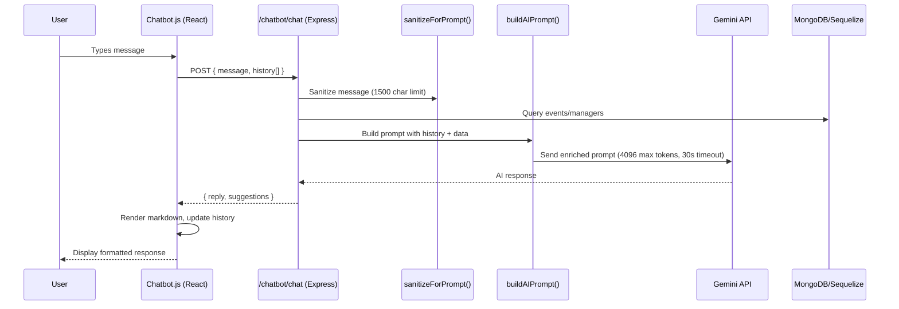

# Design Document: Chatbot Enhancement

## Overview

This design describes the technical approach for enhancing the Event Planning Assistant chatbot to deliver more comprehensive, contextually aware responses. The enhancement touches three layers of the existing system:

1. **Backend API** (`routes/chatbot.js`) — expanded input handling, conversation history processing, improved prompt construction, and result formatting
2. **AI Client** (`utils/gemini.js`) — increased token limits, extended timeout, and retry configuration
3. **Frontend Component** (`src/Chatbot.js`) — conversation history management, expanded input, and markdown rendering

The current chatbot operates in a stateless request/response mode with a 500-token output limit, 500-character input cap, and no conversation memory. The enhancement introduces session-based conversation context (up to 10 exchanges), raises the output capacity to 4096 tokens (within the 2048–8192 range), extends input acceptance to 1500 characters, and adds markdown formatting support.

## Architecture

The enhanced chatbot retains the existing three-tier architecture (React frontend → Express.js API → Google Gemini AI) with MongoDB/Sequelize for event data. The key architectural change is the introduction of a **conversation context pipeline** that flows from the frontend through the backend into the AI prompt.



### Key Architectural Decisions

| Decision | Rationale |
|----------|-----------|
| Client-side conversation history | Avoids server-side session storage, keeps backend stateless, simplifies deployment |
| 4096 token output limit | Balances detail with response time; within the 2048–8192 requirement range |
| Markdown rendering in frontend | Lightweight approach using a parsing utility rather than a heavy library |
| 30s timeout with 2 retries | Accommodates longer generation times while preventing indefinite hangs |
| History sent per-request | No WebSocket needed; works with existing REST architecture |

## Components and Interfaces

### 1. Gemini Client (`utils/gemini.js`)

**Changes:**
- `maxOutputTokens`: 500 → 4096
- `timeoutMs` default: 10000 → 30000
- `retries` default: remains 2

```javascript
// Updated configuration
const model = genAI.getGenerativeModel({
  model: "gemini-2.5-flash",
  generationConfig: {
    maxOutputTokens: 4096,
    temperature: 0.7,
  },
  safetySettings: [/* unchanged - all 4 categories at BLOCK_MEDIUM_AND_ABOVE */],
});

// Updated function signature
async function askGemini(prompt, options = {}) {
  const { retries = 2, timeoutMs = 30000 } = options;
  // ... existing retry logic unchanged
}
```

### 2. Input Sanitizer (`routes/chatbot.js` — `sanitizeForPrompt`)

**Changes:**
- Character limit: 500 → 1500
- Injection filtering applied before truncation
- Empty/whitespace-only input returns empty string

```javascript
function sanitizeForPrompt(input) {
  if (!input || !input.trim()) return "";
  // Step 1: Filter injection patterns on FULL input
  let filtered = input
    .replace(/ignore\s+(all\s+)?(previous|above|prior)\s+(instructions|rules|prompts)/gi, "[filtered]")
    .replace(/you\s+are\s+now/gi, "[filtered]")
    .replace(/system\s*:/gi, "[filtered]")
    .replace(/\bpretend\b/gi, "[filtered]")
    .replace(/\bact\s+as\b/gi, "[filtered]");
  // Step 2: Truncate to 1500 chars AFTER filtering
  return filtered.slice(0, 1500);
}
```

### 3. Conversation History Validator (`routes/chatbot.js` — new function)

**New component** that validates and trims the incoming history array.

```javascript
function validateConversationHistory(history) {
  if (!Array.isArray(history)) return [];
  const valid = history.filter(
    (msg) => msg && typeof msg.role === "string" && typeof msg.content === "string"
      && ["user", "bot"].includes(msg.role)
  );
  // Keep only last 10 exchanges (20 messages max)
  return valid.slice(-20);
}
```

### 4. AI Prompt Builder (`routes/chatbot.js` — `buildAIPrompt`)

**Changes:**
- Removes "4-6 lines max" and "top 2-3 results" constraints
- Adds conversation history section
- Adds markdown formatting instructions
- Adds contextual planning tips instruction
- Instructs to present ALL provided results with full details

```javascript
function buildAIPrompt(userMessage, data, type, conversationHistory = []) {
  const historySection = conversationHistory.length > 0
    ? `\nCONVERSATION HISTORY:\n${conversationHistory.map(m => `${m.role}: ${m.content}`).join('\n')}\n`
    : '';

  const baseRules = `
RULES:
1. Use ONLY the DATA provided below — do not invent information
2. Use markdown formatting: **bold** for names, bullet points for lists, numbered lists for results
3. Use emojis sparingly for readability
4. If contact info is in DATA, share it. If missing, say "Contact via platform"
5. Format prices with ₹ symbol
6. Be friendly, thorough, and helpful
7. Present ALL results in the DATA section with full details (name, services, price, rating, location, experience, capacity)
8. If a detail field is not available, omit it rather than showing "N/A"
9. Include 2-3 actionable planning tips relevant to the query
10. If the user references previous messages, use the conversation history to provide context-aware responses
`;
  // ... type-specific prompts follow
}
```

### 5. Chat Endpoint (`routes/chatbot.js` — `/chat`)

**Changes:**
- Accepts `history` array in request body
- Validates history before use
- Passes history to prompt builder
- Short-response fallback (< 50 chars for search queries)
- Deduplication limit raised to 5 results

### 6. Frontend Chatbot Component (`src/Chatbot.js`)

**Changes:**
- Maintains conversation history state (array of `{role, content}`)
- Sends history with each API request
- Trims history to 10 most recent exchanges before sending
- Input field accepts up to 1500 characters (with character counter)
- Renders markdown in bot messages (bold, bullets, numbered lists, headings)
- Typing indicator shown immediately on send

### Interface Contracts

**POST `/api/chatbot/chat` Request:**
```json
{
  "message": "string (1-1500 chars)",
  "history": [
    { "role": "user", "content": "previous user message" },
    { "role": "bot", "content": "previous bot response" }
  ]
}
```

**POST `/api/chatbot/chat` Response (unchanged structure):**
```json
{
  "reply": "string (markdown-formatted response)",
  "suggestions": ["string", "string"]
}
```

## Data Models

### Conversation History Message Object (Client-Side)

No database schema changes are required. Conversation history is managed entirely in the frontend React state and sent per-request.

```typescript
interface ConversationMessage {
  role: "user" | "bot";
  content: string;
}

// Frontend state shape
interface ChatbotState {
  messages: Array<{
    type: "user" | "bot";
    text: string;
    suggestions?: string[];
  }>;
  conversationHistory: ConversationMessage[]; // max 20 items (10 exchanges)
  input: string; // max 1500 chars
  isOpen: boolean;
  isTyping: boolean;
}
```

### Request Body Schema

```typescript
interface ChatRequest {
  message: string;          // 1-1500 characters, sanitized
  history?: ConversationMessage[]; // optional, max 20 items
}
```

### AI Prompt Structure

```typescript
interface PromptComponents {
  systemInstruction: string;   // Role and rules
  conversationHistory: string; // Formatted prior exchanges
  userData: string;            // Current user message
  searchResults: string;       // Formatted event data
  responseGuidance: string;    // Type-specific instructions
}
```

### Existing Models (Unchanged)

The following Sequelize models remain unchanged:
- `Event` — event listings with price, category, location, maxGuests, etc.
- `EventManager` — manager profiles with rating, experience, serviceAreas
- `User` — user accounts with name, email, mobile
- `Booking` — booking records (not directly used by chatbot)

## Correctness Properties

*A property is a characteristic or behavior that should hold true across all valid executions of a system — essentially, a formal statement about what the system should do. Properties serve as the bridge between human-readable specifications and machine-verifiable correctness guarantees.*

### Property 1: Input sanitizer preserves content up to 1500 characters

*For any* input string of length ≤ 1500 that contains no prompt injection patterns and is not whitespace-only, the sanitizer SHALL return the string unchanged. *For any* input string of length > 1500, the sanitizer SHALL return a string of exactly 1500 characters representing the first 1500 characters of the filtered input.

**Validates: Requirements 3.1, 3.3**

### Property 2: Injection filtering applied before truncation

*For any* input string containing a prompt injection pattern (e.g., "ignore previous instructions", "you are now", "system:", "pretend", "act as") at any position in the string, the sanitizer SHALL replace that pattern with "[filtered]" regardless of whether the pattern appears before or after the 1500-character boundary. The filtering step SHALL execute on the full input before any truncation is applied.

**Validates: Requirements 3.2, 3.5, 8.7**

### Property 3: Whitespace-only input rejection

*For any* string composed entirely of whitespace characters (spaces, tabs, newlines, or combinations thereof), or an empty string, the sanitizer SHALL return an empty string.

**Validates: Requirements 3.4**

### Property 4: Conversation history validation and trimming

*For any* array of message objects, the history validator SHALL return only objects that have a valid `role` field ("user" or "bot") and a valid `content` field (string). *For any* input array with more than 20 valid messages, the validator SHALL return only the last 20 messages (representing the 10 most recent exchanges).

**Validates: Requirements 4.2, 4.5, 4.7**

### Property 5: Conversation history included in prompt chronologically

*For any* non-empty validated conversation history, the built AI prompt SHALL contain all history messages in the same chronological order as the input array, with each message's role and content represented in the prompt text.

**Validates: Requirements 4.3, 4.4**

### Property 6: AI response passthrough without truncation

*For any* AI-generated response string of length ≥ 50 characters, the chatbot backend SHALL include that response in its reply without applying any character-limit truncation or substring operations.

**Validates: Requirements 1.2**

### Property 7: Short response fallback

*For any* AI-generated response string shorter than 50 characters when search result data is present, the chatbot backend SHALL return the pre-formatted result text instead of the short AI response.

**Validates: Requirements 1.5**

### Property 8: Result deduplication limits to 5 unique managers

*For any* set of search results containing events from multiple managers (including duplicates), the deduplication logic SHALL produce at most 5 results, each from a unique manager, preserving the sort order.

**Validates: Requirements 2.3**

### Property 9: Result formatting field order consistency

*For any* event and manager data combination, the `formatEventResult` function SHALL produce output with fields in the fixed order: name, services/areas, rating/experience, price, capacity (if available), duration (if available), category/package, includes (if available), addons (if available), dates (if available), venue (if available), contact.

**Validates: Requirements 6.3**

### Property 10: Markdown rendering correctness

*For any* bot message string containing supported markdown tokens (`**bold**`, `- bullet`, `1. numbered`, `## heading`), the frontend markdown renderer SHALL convert them to corresponding styled HTML elements (strong, ul/li, ol/li, h2) without altering the text content between tokens.

**Validates: Requirements 6.4**

### Property 11: Query parsing extraction

*For any* user message containing a location keyword pattern (e.g., "in {city}"), a price pattern (e.g., "under {number}"), a rating pattern (e.g., "rating above {number}"), an experience pattern (e.g., "{number} years experience"), or a guest count pattern (e.g., "for {number} guests"), the `parseUserQuery` function SHALL extract the corresponding numeric or string value into the correct field of the returned query object.

**Validates: Requirements 8.4**

### Property 12: Response structure consistency

*For any* valid request to the `/chatbot/chat` endpoint that does not trigger a server error, the response JSON SHALL contain a `reply` field of type string. If a `suggestions` field is present, it SHALL be an array of strings.

**Validates: Requirements 8.8**

## Error Handling

### Backend Error Scenarios

| Error Condition | Handling Strategy | Response |
|----------------|-------------------|----------|
| Gemini API timeout (all retries exhausted) | Return graceful message | HTTP 200: "I'm taking a bit longer than expected to respond. Please try again in a moment." |
| Gemini API rate limit (429) | Exponential backoff between retries | After exhaustion: HTTP 200 with fallback formatted results |
| Gemini safety filter block | No retry, return null | HTTP 200: fallback to pre-formatted results or generic advice |
| Gemini API key missing | Skip AI call entirely | HTTP 200: fallback to pre-formatted results |
| AI response too short (< 50 chars) with search data | Use pre-formatted results | HTTP 200: formatted result text |
| Invalid conversation history | Discard invalid entries, continue | Process with valid history only |
| Empty/whitespace message | Reject early | HTTP 200: "Please type a message to get started." |
| Database query failure | Catch and log | HTTP 500: "Having trouble connecting. Please try again!" |
| Rate limit exceeded | express-rate-limit middleware | HTTP 429: "You're sending messages too fast." |

### Frontend Error Scenarios

| Error Condition | Handling Strategy |
|----------------|-------------------|
| API request fails (network error) | Display "Sorry, I'm having trouble connecting right now. Please try again later." |
| API returns non-200 status | Display error message from response or generic fallback |
| Markdown rendering fails | Display raw text content (graceful degradation) |
| History exceeds 10 exchanges | Trim to most recent 10 before sending |

### Retry Strategy

```
Attempt 1: Send request (30s timeout)
  → On timeout/error: wait 1s
Attempt 2: Retry (30s timeout)
  → On timeout/error: wait 2s
Attempt 3: Final retry (30s timeout)
  → On failure: return fallback response
```

Rate limit (429) errors use progressive backoff: 1s, 2s between retries.
Safety filter blocks are not retried (immediate fallback).

## Testing Strategy

### Property-Based Tests

Property-based testing is appropriate for this feature because it contains several pure functions with clear input/output behavior (sanitizer, history validator, prompt builder, query parser, result formatter, markdown renderer) where universal properties hold across a wide input space.

**Library:** [fast-check](https://github.com/dubzzz/fast-check) (JavaScript PBT library)

**Configuration:**
- Minimum 100 iterations per property test
- Each test tagged with: `Feature: chatbot-enhancement, Property {number}: {property_text}`

**Properties to implement:**
1. Input sanitizer length handling (Property 1)
2. Injection filtering before truncation (Property 2)
3. Whitespace rejection (Property 3)
4. History validation and trimming (Property 4)
5. History in prompt chronologically (Property 5)
6. AI response passthrough (Property 6)
7. Short response fallback (Property 7)
8. Result deduplication (Property 8)
9. Result formatting field order (Property 9)
10. Markdown rendering (Property 10)
11. Query parsing extraction (Property 11)
12. Response structure consistency (Property 12)

### Unit Tests (Example-Based)

| Area | Test Cases |
|------|-----------|
| Prompt templates | Verify no "4-6 lines max" or "top 2-3 results" constraints (Req 1.3, 2.1, 2.2) |
| Prompt content | Verify instructions include all required detail fields (Req 2.4, 2.5) |
| Greeting handler | Test "hi", "hello", "hey" return welcome + suggestions (Req 8.1) |
| Help handler | Test "help", "commands" return filter list (Req 8.2) |
| Suggest handler | Test "suggest", "recommend" return events + suggestions (Req 8.3) |
| Follow-up prompt | Verify prompt includes follow-up interpretation instruction (Req 5.3) |
| Planning advice prompt | Verify non-search queries include planning advice instruction (Req 9.1, 9.2, 9.3) |
| Typing indicator | Verify indicator appears on send, disappears on response (Req 7.3, 7.4) |
| Configuration | Verify token limit, timeout, safety settings values (Req 1.1, 7.1, 8.5, 8.6) |

### Integration Tests

| Scenario | Verification |
|----------|-------------|
| Full chat flow with mock Gemini | End-to-end request/response with history |
| Timeout handling | Mock timeout, verify graceful fallback (Req 7.2) |
| Follow-up query resolution | Send sequence of messages, verify context retention (Req 5.1, 5.2) |
| Invalid result reference | Reference non-existent result, verify error message (Req 5.4) |
| Rate limiting | Send 16 requests in 1 minute, verify 16th is blocked (Req 8.6) |
| AI response without tips | Mock response missing tips, verify results still returned (Req 9.4) |

### Test File Structure

```
backend_after Editing/
  __tests__/
    chatbot/
      sanitizer.property.test.js    — Properties 1, 2, 3
      history.property.test.js      — Properties 4, 5
      prompt.property.test.js       — Properties 5, 6, 7
      dedup.property.test.js        — Property 8
      formatter.property.test.js    — Property 9
      parser.property.test.js       — Property 11
      chatbot.unit.test.js          — Example-based unit tests
      chatbot.integration.test.js   — Integration tests
frontend_After Editing/
  src/__tests__/
    Chatbot.property.test.js        — Properties 10, 12
    Chatbot.unit.test.js            — UI unit tests
```

